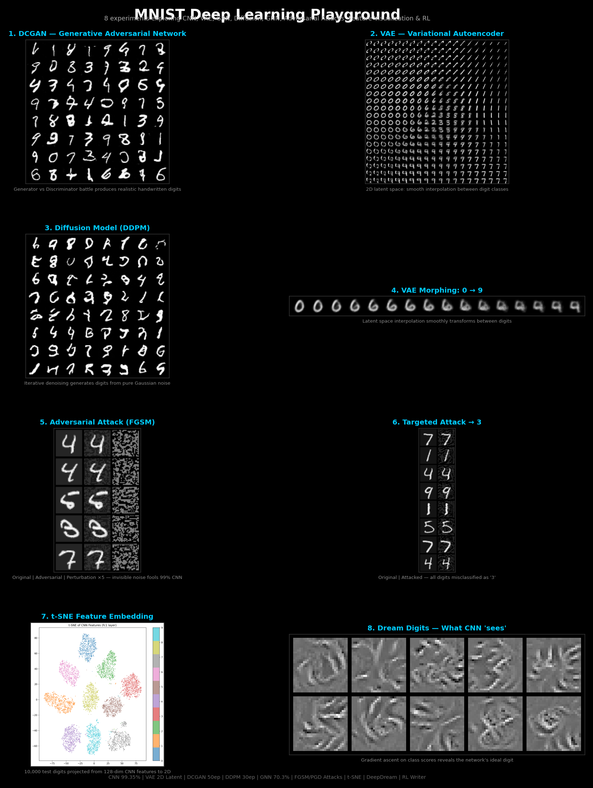
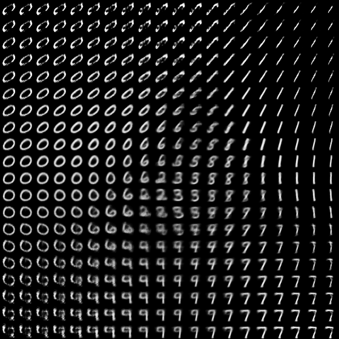
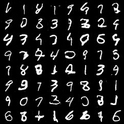
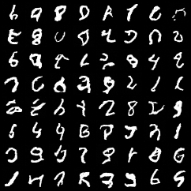
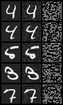
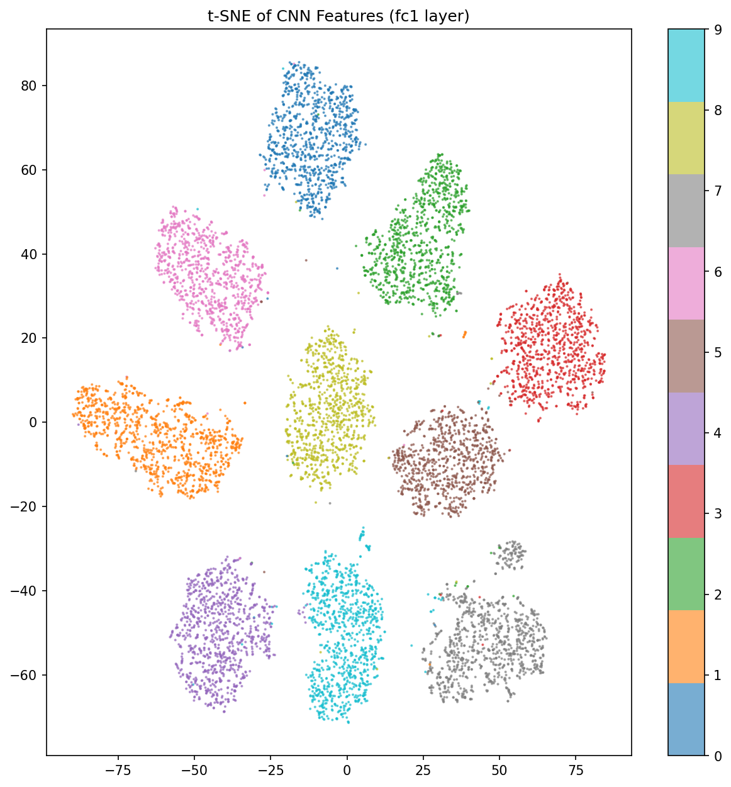

# MNIST Deep Learning Playground

8 experiments exploring the full spectrum of deep learning — from basic classification to generative models, adversarial attacks, and reinforcement learning — all on MNIST.



## Experiments

| # | Experiment | Script | Key Result |
|---|-----------|--------|------------|
| 1 | **CNN Classification** | `01_basic_cnn.py` | 99.35% accuracy in 10 epochs |
| 2 | **VAE** (Variational Autoencoder) | `02_vae.py` | 2D latent space + digit morphing |
| 3 | **DCGAN** (Generative Adversarial Network) | `03_gan.py` | Realistic digit generation |
| 4 | **Diffusion Model** (DDPM) | `04_diffusion.py` | Denoising-based generation |
| 5 | **GNN** (Graph Neural Network) | `05_gnn_mnist.py` | Pixels as graph nodes, 70.3% |
| 6 | **Adversarial Attacks** (FGSM/PGD) | `06_adversarial_attack.py` | Invisible perturbations fool 99% CNN |
| 7 | **Feature Visualization** | `07_neural_style_transfer.py` | t-SNE, activation maps, dream digits |
| 8 | **RL Digit Writer** | `08_reinforcement_learning.py` | DQN agent learns to draw digits |

## Quick Start

```bash
# Install dependencies
pip install torch torchvision torch-geometric scikit-learn matplotlib Pillow

# Run all experiments sequentially
python 01_basic_cnn.py
python 02_vae.py
python 03_gan.py
python 04_diffusion.py
python 05_gnn_mnist.py
python 06_adversarial_attack.py
python 07_neural_style_transfer.py
python 08_reinforcement_learning.py

# Generate showcase image
python make_showcase.py
```

## Pre-trained Models

| Model | File | Size |
|-------|------|------|
| CNN (99.35%) | `models/basic_cnn.pth` | ~200KB |
| VAE | `models/vae.pth` | ~2MB |
| DCGAN Generator | `models/gan_generator.pth` | ~3MB |
| Diffusion U-Net | `models/diffusion.pth` | ~5MB |
| GNN | `models/gnn_mnist.pth` | ~100KB |

## Sample Outputs

### VAE Latent Space
Smooth interpolation between digit classes in 2D latent space:



### VAE Morphing: 0 → 9


### DCGAN Generated Digits


### Diffusion Model (DDPM)


### Adversarial Attacks
Invisible perturbations that fool a 99% accurate CNN:



### t-SNE Feature Embedding
10,000 test digits projected from 128-dim CNN features:



## Requirements

- Python 3.8+
- PyTorch 2.0+
- torchvision
- torch-geometric (for GNN experiment)
- scikit-learn (for t-SNE)
- matplotlib, Pillow

GPU recommended but all experiments run on CPU too.

## License

MIT
