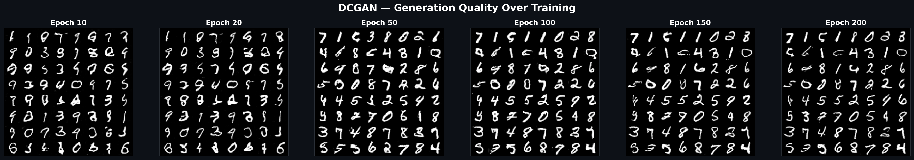
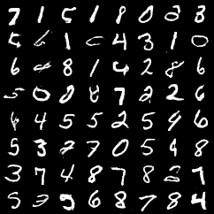
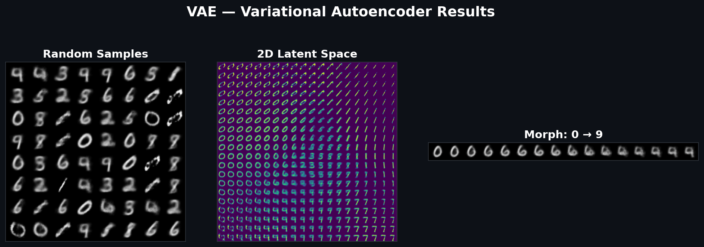
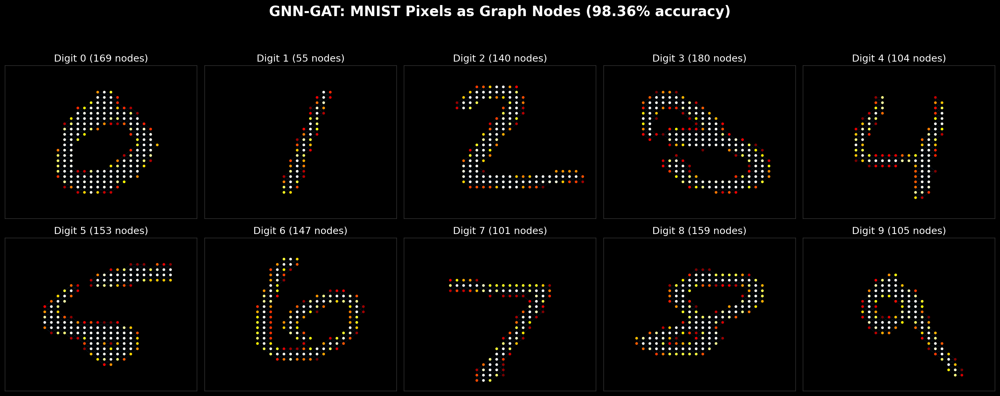
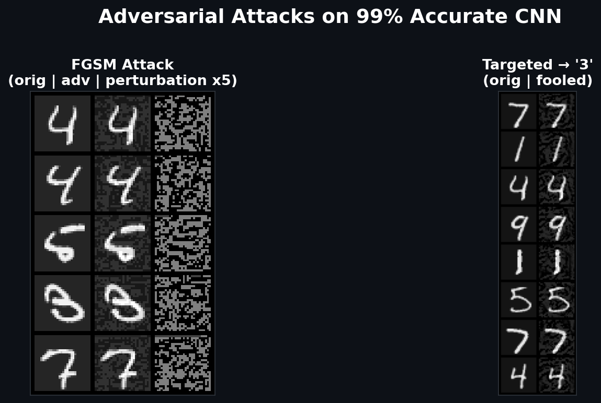
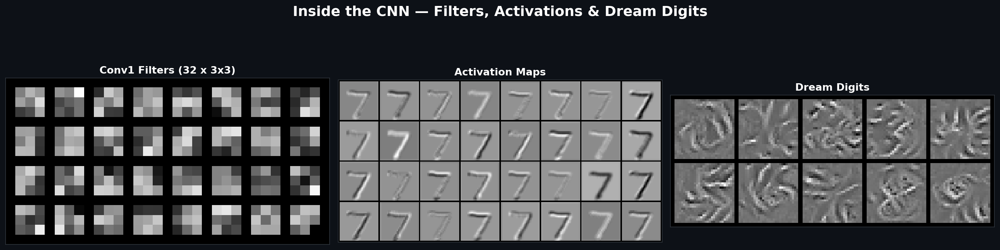
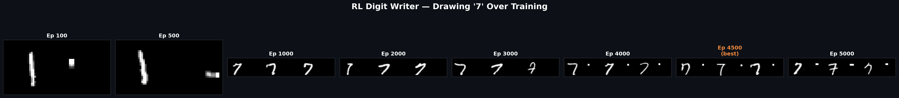
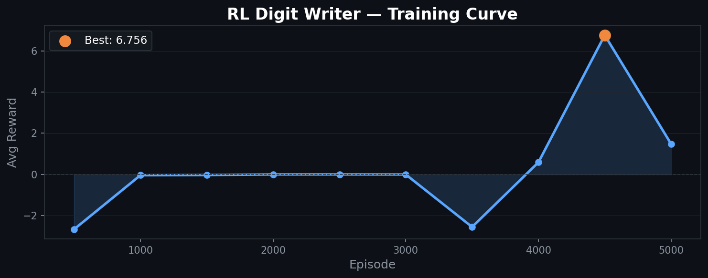

# MNIST Deep Learning Playground

8 experiments exploring the full spectrum of deep learning — from basic classification to generative models, adversarial attacks, and reinforcement learning — all on MNIST.

<p align="center">
  
</p>

## Experiments

| # | Experiment | Script | Key Result |
|---|-----------|--------|------------|
| 1 | **CNN Classification** | `01_basic_cnn.py` | 99.35% accuracy in 10 epochs |
| 2 | **VAE** (Variational Autoencoder) | `02_vae.py` | 2D latent space + digit morphing |
| 3 | **DCGAN** (Generative Adversarial Network) | `03_gan.py` | 200ep, hinge loss + spectral norm |
| 4 | **Diffusion Model** (DDPM) | `04_diffusion.py` | Denoising-based generation |
| 5 | **GNN-GAT** (Graph Attention Network) | `05_gnn_mnist.py` | Pixels as graph nodes, **98.36%** |
| 6 | **Adversarial Attacks** (FGSM/PGD) | `06_adversarial_attack.py` | Invisible perturbations fool 99% CNN |
| 7 | **Feature Visualization** | `07_neural_style_transfer.py` | t-SNE, activation maps, dream digits |
| 8 | **RL Digit Writer** (PPO) | `08_reinforcement_learning.py` | PPO agent learns to draw digit "7" |

## Quick Start

```bash
pip install torch torchvision torch-geometric scikit-learn matplotlib Pillow

python 01_basic_cnn.py    # CNN
python 02_vae.py          # VAE
python 03_gan.py          # GAN
python 04_diffusion.py    # Diffusion
python 05_gnn_mnist.py    # GNN
python 06_adversarial_attack.py
python 07_neural_style_transfer.py
python 08_reinforcement_learning.py

python make_showcase.py   # Generate showcase
```

## Pre-trained Models

| Model | File | Size |
|-------|------|------|
| CNN (99.35%) | `models/basic_cnn.pth` | ~200KB |
| VAE | `models/vae.pth` | ~2MB |
| DCGAN Generator | `models/gan_generator.pth` | ~3MB |
| Diffusion U-Net | `models/diffusion.pth` | ~5MB |
| GNN-GAT (98.36%) | `models/gnn_mnist.pth` | ~500KB |
| RL Writer (PPO) | `models/rl_writer.pth` | ~3MB |

---

## Results

### 1. DCGAN — Generation Quality Over Training



After 200 epochs with hinge loss + spectral norm, the generator produces crisp, diverse handwritten digits.



### 2. VAE — Latent Space, Samples & Morphing



2D latent space enables smooth interpolation. Walking through the space morphs one digit into another.

### 3. Diffusion Model (DDPM)


U-Net iteratively denoises pure Gaussian noise into recognizable digits over 1000 timesteps.

### 4. GNN-GAT — Pixels as Graph Nodes (98.36%)



Each bright pixel becomes a graph node, connected to 8 neighbors. Graph Attention Network with multi-head attention achieves **98.36%** — remarkably close to CNN.

### 5. Adversarial Attacks



FGSM and PGD generate invisible perturbations that fool a 99% accurate CNN. Targeted attacks force any digit to be classified as "3".

### 6. Inside the CNN — Filters, Activations & Dream Digits



Visualizing what the network learns: conv1 filters, activation maps on a sample digit, and gradient-ascent "dream" images revealing each class's ideal pattern.

### 7. t-SNE Feature Embedding


10,000 test digits projected from 128-dim CNN features to 2D. Clean cluster separation shows the network has learned meaningful representations.

### 8. RL Digit Writer (PPO)

A PPO agent controls a pen on a 28x28 canvas to draw "7". Training progression:





The agent starts with random scribbles, learns stroke patterns by episode 1000, and peaks at episode 4500 (best reward: 6.756).

---

## Requirements

- Python 3.8+
- PyTorch 2.0+
- torchvision
- torch-geometric (for GNN experiment)
- scikit-learn (for t-SNE)
- matplotlib, Pillow

GPU recommended but all experiments run on CPU too.

## License

MIT
