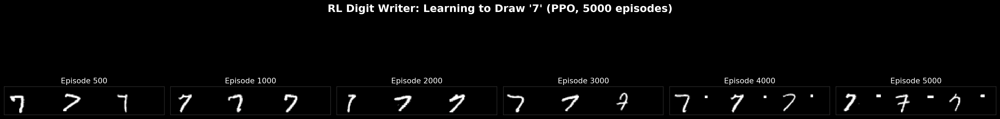

# MNIST Deep Learning Playground

8 experiments exploring the full spectrum of deep learning — from basic classification to generative models, adversarial attacks, and reinforcement learning — all on MNIST.

<p align="center">
  
</p>

## Experiments

| # | Experiment | Script | Key Result |
|---|-----------|--------|------------|
| 1 | **CNN Classification** | `01_basic_cnn.py` | 99.35% accuracy in 10 epochs |
| 2 | **VAE** (Variational Autoencoder) | `02_vae.py` | 2D latent space + digit morphing |
| 3 | **DCGAN** (Generative Adversarial Network) | `03_gan.py` | 200ep, hinge loss + spectral norm |
| 4 | **Diffusion Model** (DDPM) | `04_diffusion.py` | Denoising-based generation |
| 5 | **GNN-GAT** (Graph Attention Network) | `05_gnn_mnist.py` | Pixels as graph nodes, **98.36%** |
| 6 | **Adversarial Attacks** (FGSM/PGD) | `06_adversarial_attack.py` | Invisible perturbations fool 99% CNN |
| 7 | **Feature Visualization** | `07_neural_style_transfer.py` | t-SNE, activation maps, dream digits |
| 8 | **RL Digit Writer** (PPO) | `08_reinforcement_learning.py` | PPO agent learns to draw digit "7" |

## Quick Start

```bash
# Install dependencies
pip install torch torchvision torch-geometric scikit-learn matplotlib Pillow

# Run all experiments sequentially
python 01_basic_cnn.py
python 02_vae.py
python 03_gan.py
python 04_diffusion.py
python 05_gnn_mnist.py
python 06_adversarial_attack.py
python 07_neural_style_transfer.py
python 08_reinforcement_learning.py

# Generate showcase image
python make_showcase.py
```

## Pre-trained Models

| Model | File | Size |
|-------|------|------|
| CNN (99.35%) | `models/basic_cnn.pth` | ~200KB |
| VAE | `models/vae.pth` | ~2MB |
| DCGAN Generator | `models/gan_generator.pth` | ~3MB |
| Diffusion U-Net | `models/diffusion.pth` | ~5MB |
| GNN-GAT (98.36%) | `models/gnn_mnist.pth` | ~500KB |
| RL Writer (PPO) | `models/rl_writer.pth` | ~3MB |

## Sample Outputs

### DCGAN Generated Digits (200 epochs)


### VAE Latent Space

Smooth interpolation between digit classes in 2D latent space:


### VAE Morphing: 0 → 9


### Diffusion Model (DDPM)


### Adversarial Attacks

Invisible perturbations that fool a 99% accurate CNN:


### GNN-GAT Classification (98.36%)

Pixels converted to graph nodes with 8-neighbor edges. GAT with multi-head attention achieves 98.36%:


### RL Digit Writer (PPO)

PPO agent learns to control a pen on a 28x28 canvas. Training progression over 5000 episodes:



### t-SNE Feature Embedding

10,000 test digits projected from 128-dim CNN features:


## Requirements

- Python 3.8+
- PyTorch 2.0+
- torchvision
- torch-geometric (for GNN experiment)
- scikit-learn (for t-SNE)
- matplotlib, Pillow

GPU recommended but all experiments run on CPU too.

## License

MIT
